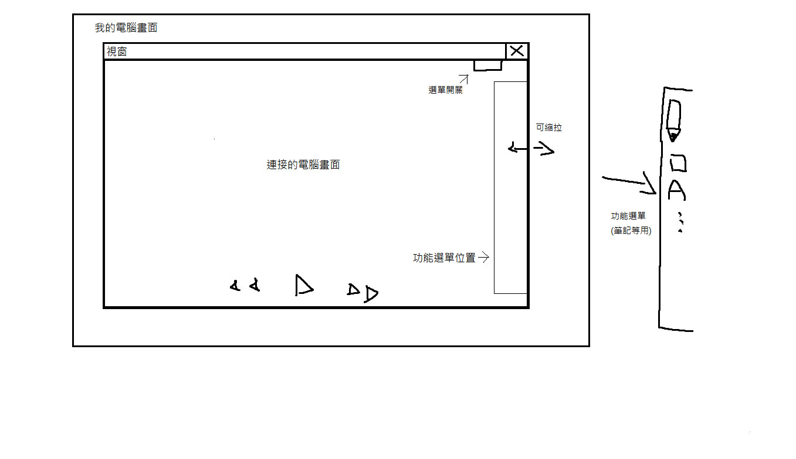

# team13

### 組員： 0424069 謝廣獻
###        0424071 陳朱暉
###        0424079 宋東儒

### 指導老師: 周斯畏

###  題目: 教學廣播系統
###  工具: java/python
###  內容: 以類似觀看直播的方式，讓學生上課時連接老師的電腦畫面，讓學生在上實作課時也能同時操作電腦而不用怕記不住上課內容。
##  介面:

# 需求分析
### 功能性需求
### 1.視窗大小縮放
### 2.錄影功能
### 3.複製貼上功能
### 4.繪筆
### 非功能性需求
### 1.錄製權限
### 2.視窗關閉按鈕
### 
### 
.pdf "未命名(1)")
